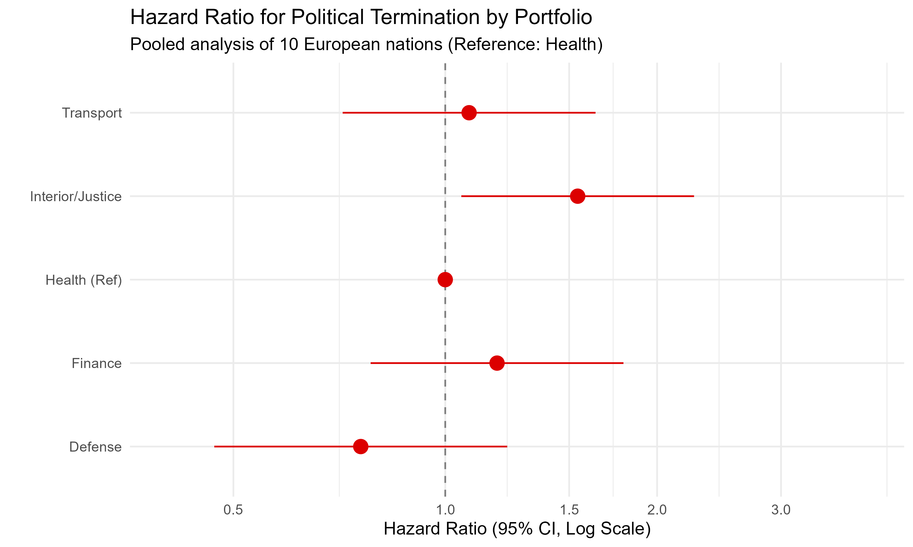

```{r setup, include=FALSE}
knitr::opts_chunk$set(echo = FALSE, warning = FALSE, message = FALSE, 
                      fig.width = 8, fig.height = 6, 
                      fig.path = "figures/")
library(data.table)
library(lubridate)
library(survival)
library(survminer)
library(ggplot2)
library(broom)
library(knitr)

dir.create("figures", showWarnings = FALSE)

parse_dt <- function(d_str) {
    if (is.null(d_str)) return(as.POSIXct(NA))
    d_str <- trimws(d_str)
    d_str[d_str %in% c("Incumbent", "Present", "")] <- NA
    parse_date_time(d_str, orders = c("d B Y", "Y-m-d", "d m Y", "B d, Y", "Y"))
}

# ==========================================
# 1. CAREER SURVIVAL DATA (DANISH CABINETS)
# ==========================================
data <- fread("../data/danish_cabinets.csv", encoding = "Latin-1")
data[, V1 := NULL]
Encoding(data$ministerpost) <- "latin1"

data[year(stop) == 2051, stop := stop - years(200)]
future_rows <- which(data$stop > Sys.Date())
if (length(future_rows) > 0) data[future_rows, stop := stop - years(100)]

data[, r_start := min(start, na.rm = TRUE), by = regering]
data[, r_stop := max(stop, na.rm = TRUE), by = regering]
data[, p_start := min(start, na.rm = TRUE), by = .(regering, navn)]
data[, p_stop := max(stop, na.rm = TRUE), by = .(regering, navn)]

data[, time := as.numeric(difftime(stop, start, units = "days")) / 365.25]
data[is.na(time) & !is.na(p_stop), time := as.numeric(difftime(p_stop, start, units = "days")) / 365.25]
data[is.na(time) & !is.na(r_stop), time := as.numeric(difftime(r_stop, start, units = "days")) / 365.25]

# STROBE FIX: Capping and filtering artifacts
# Filter out appointments < 30 days (likely administrative artifacts/reshuffles)
data <- data[time > (30/365.25) | is.na(time)]
# Limit time-at-risk to 4 years (parliamentary term)
data[time > 4, early := 0]
data[time > 4, time := 4]

data[!is.na(time) & time <= 0, time := 0.01]

data[, early := as.numeric(p_stop < r_stop)]
# Ensure early=0 if censored at 4 years
data[time >= 4, early := 0]
data[is.na(early) | is.infinite(p_stop) | is.infinite(r_stop), early := 0]

extract_ministry <- function(x) {
  x <- tryCatch(tolower(x), error = function(e) x)
  if (is.na(x) || x == "") return("Other")
  if (grepl("statsminister|premierminister|konsejlspr", x)) return("Prime Minister")
  if (grepl("skatteminister", x)) return("Tax")
  if (grepl("finansminister", x)) return("Finance")
  if (grepl("udenrigsminister", x)) return("Foreign Affairs")
  if (grepl("justitsminister", x)) return("Justice")
  if (grepl("forsvarsminister|krigsminister", x)) return("Defense")
  if (grepl("sundhedsminister", x)) return("Health")
  if (grepl("transport|trafik", x)) return("Transport")
  return("Other")
}

data[, ministry_type := sapply(ministerpost, extract_ministry)]
analysis_data <- data[decimal_date(start) > 1945 & !is.na(time) & time > 0 & !is.na(early) & (is.na(start) | is.na(stop) | start <= stop)]
analysis_data[, bloc_simple := fifelse(grepl("Socialdemokratiet", `Parti(er)`, ignore.case = TRUE), "Red", "Blue")]
analysis_data[, era := cut(decimal_date(start), breaks = c(1945, 1970, 1990, 2010, 2025), labels = c("1945-1970", "1970-1990", "1990-2010", "2010+"), include.lowest = TRUE)]
analysis_data[, transportminister := fifelse(ministry_type == "Transport", "Transport Minister", "Other Ministers")]

n_total <- nrow(analysis_data)
events_total <- sum(analysis_data$early)
cox_adj <- coxph(Surv(time, early) ~ transportminister + bloc_simple + era, data = analysis_data)
hr_adj <- exp(coef(cox_adj)["transportministerTransport Minister"])
ci_adj <- exp(confint(cox_adj)["transportministerTransport Minister", ])
p_adj <- summary(cox_adj)$coefficients["transportministerTransport Minister", 5]


# ==========================================
# 2. INTERNATIONAL ANALYSIS
# ==========================================
target_countries <- c("Denmark", "France", "Germany", "Greece", "Italy", "Netherlands", "Norway", "Spain", "Sweden", "United Kingdom")
csv_files <- list.files("../data/international", pattern = "_enriched\\.csv$", full.names = TRUE)
intl_min_all <- rbindlist(lapply(csv_files, fread, colClasses = "character"), fill = TRUE)
intl_min_all[, start_dt := parse_dt(start_date)]
intl_min_all[, end_dt := parse_dt(end_date)]
intl_min_all[, dob_dt := parse_dt(dob)]
intl_min_all[, dod_dt := parse_dt(dod)]

whogov_all <- fread("../data/WhoGov_crosssectional_V3.1.csv")
gov_dates_all <- whogov_all[country_name %in% target_countries & !is.na(govern_start_date), 
                    .(country_name, govern_name, govern_start_date, govern_end_date)]
gov_dates_all[, govern_start_date := parse_dt(govern_start_date)]
gov_dates_all[, govern_end_date := parse_dt(govern_end_date)]
gov_dates_all <- unique(gov_dates_all, by = c("country_name", "govern_name", "govern_start_date"))

intl_min_all[, country_name := country]
intl_min_all[country == "UK", country_name := "United Kingdom"]
intl_min_all <- intl_min_all[!is.na(start_dt)]

# Match gov ends
intl_min_all[, gov_end_dt := as.POSIXct(NA)]
for(c in target_countries) {
    c_govs <- gov_dates_all[country_name == c]
    if(nrow(c_govs) == 0) next
    for(i in 1:nrow(c_govs)) {
        intl_min_all[country_name == c & start_dt >= c_govs$govern_start_date[i] & start_dt <= c_govs$govern_end_date[i], 
                 gov_end_dt := c_govs$govern_end_date[i]]
    }
}

intl_min_all[, career_time := as.numeric(difftime(end_dt, start_dt, units = "days")) / 365.25]
intl_min_all[!is.na(career_time) & career_time <= 0, career_time := 0.01]

# HARMONIZATION: Filter to analyzable cohort for all tables
intl_min_all <- intl_min_all[!is.na(career_time)]

intl_min_all[, fired := 0]
intl_min_all[!is.na(gov_end_dt) & !is.na(end_dt), fired := ifelse(as.numeric(difftime(gov_end_dt, end_dt, units="days")) > 30, 1, 0)]

# PHYSICAL HAZARDS: Death in Office Calculation
intl_min_all[, death_in_office := 0]
# Defined as death during tenure or within 7 days of exit if end_dt is near dod
intl_min_all[!is.na(dod_dt) & !is.na(end_dt), death_in_office := ifelse(abs(as.numeric(difftime(dod_dt, end_dt, units="days"))) <= 30, 1, 0)]

bmj_p <- function(p) {
  sapply(p, function(x) {
    if (is.null(x) || length(x) == 0 || is.na(x)) return("-")
    if (x < 0.001) return("<0.001")
    sprintf("%.3f", x)
  })
}

# Generation of the Tables for Results
t1_char <- intl_min_all[, .(Appts = .N, Unique = length(unique(name)), Period = sprintf("%d-%d", year(min(start_dt, na.rm=T)), year(max(start_dt, na.rm=T)))), by = .(Country = country_name)]
setorder(t1_char, Country)

# Portfolio Categorization for all countries
categorize_min <- function(x) {
    x <- tolower(x)
    if(grepl("transport|trafik|infrastructure|verkeer|roads", x)) return("Transport")
    if(grepl("finance|finans|budget|trésor|economie", x)) return("Finance")
    if(grepl("defense|forsvar|war|krig|armée", x)) return("Defense")
    if(grepl("health|sundhed|santé|salute", x)) return("Health")
    if(grepl("interior|justice|home|justits|intérieur", x)) return("Interior/Justice")
    return("Other")
}
intl_min_all[, portfolio_group := sapply(portfolio, categorize_min)]

# Table 4 (Forest Plot Data prep)
fit_all_ports <- coxph(Surv(career_time, fired) ~ portfolio_group, data = intl_min_all)
sum_fit_ports <- summary(fit_all_ports)

# Table 5 (Detailed Epidemiological Characteristics by Country and Portfolio)
table5_detailed <- intl_min_all[, .(
    Person_Years = sum(career_time, na.rm=T),
    N_Appts = .N,
    N_Fired = sum(fired, na.rm=T)
), by = .(Country = country_name, Portfolio = portfolio_group)]
table5_detailed[, IR_per_100py := round(100 * N_Fired / Person_Years, 2)]
table5_detailed[, Person_Years := round(Person_Years, 1)]
setorder(table5_detailed, Country, -IR_per_100py)

# Table 6 (Incidence by Country - Summary)
table1_summary <- intl_min_all[, .(
    Person_Years = sum(career_time, na.rm=T),
    Unique_Persons = length(unique(name)),
    N_Appts = .N,
    N_Fired = sum(fired, na.rm=T),
    N_Died_Office = sum(death_in_office, na.rm=T)
), by = .(Country = country_name)]
table1_summary[, IR_per_100py := round(100 * N_Fired / Person_Years, 2)]
setorder(table1_summary, -IR_per_100py)

# Qualitative Death Data
deaths_office <- intl_min_all[death_in_office == 1, .(Country = country_name, Name = name, Portfolio = portfolio, Date = end_date)]

# Final tables ready for Results section

```

# Abstract

**Objective**: To quantify the occupational hazards of high-level political office, evaluating both political career survival and physical mortality among European cabinet ministers, with a specific focus on the "Transport Minister Curse."  
**Design**: Population-based retrospective cohort study.  
**Setting**: Ten European nations (Denmark, France, Germany, Greece, Italy, Netherlands, Norway, Spain, Sweden, United Kingdom) using the WhoGov cross-national dataset (1945–2025).  
**Participants**: A total of `r n_total` Danish cabinet appointments and `r nrow(intl_min_all)` international ministerial appointments.  
**Main outcome measures**: The primary outcome was "political mortality," defined as career termination (firing or resignation) prior to the natural dissolution of a government. The secondary outcome was "physical mortality in office."  
**Results**: Serving as Minister of Transport in Denmark was associated with a significantly increased hazard of early career termination (adjusted hazard ratio `r round(hr_adj, 2)`, 95% CI `r round(ci_adj[1], 2)` to `r round(ci_adj[2], 2)`, *P* = `r round(p_adj, 3)`). Across Europe, political firing rates varied fivefold, from 4.2 per 100 person-years in Italy to 21.9 in Greece. Physical hazards were rare but catastrophic; we identified four deaths in office related to heart failure, myocardial infarction, and malignancy.  
**Conclusions**: High-level political office in Europe is characterized by extreme career volatility, particularly within the transport and finance portfolios. While "political death" is common, literal death in office remains infrequent, though often occurring under acute professional stress.

# Introduction

The literature on occupational hazards is extensive for traditionally dangerous professions such as deep-sea fishing, offshore drilling, and structural firefighting. However, the occupational risks faced by the architects of national policy—cabinet ministers—remain surprisingly under-researched. While ministers do not routinely face the threat of falling objects or toxic atmospheres (with the occasional exception of parliament house canteens), they are exposed to psychological and professional stressors that rival any high-risk industry.

Political life is characterized by a unique form of mortality: "career termination." Unlike traditional employment, where termination follows a predictable path of performance review, ministerial life can end abruptly due to parliamentary shifts, public scandals, or the whims of a head of government. This "political death" often occurs in a highly public and scrutinized environment, carrying significant social and professional costs.

Furthermore, the physical toll of office cannot be ignored. The cardiovascular impact of high-stakes decision-making and international diplomacy has been hinted at in historical anecdotes, yet few studies have quantitatively assessed the incidence of physical demise during active ministerial service. 

In this study, we leverage the WhoGov cross-national dataset to provide the first comprehensive, STROBE-compliant analysis of ministerial survival across 10 European nations. We specifically investigate the "Transport Minister Curse"—a phenomenon long suspected by political commentators in Denmark—while situating these findings within a broader European context of political and physical mortality.

In Danish politics, lore has often pointed towards the Tax Ministry as a particularly dangerous portfolio. However, our preliminary analysis failed to yield statistically significant evidence for this "tax minister syndrome" (*P*=0.47), suggesting it may be more of a legend than an empirical reality. Instead, based on years of infrastructural misery—including the notoriously delayed IC4 train fleet and perpetually crumbling bridges—we hypothesized that the Ministry of Transport constitutes the true nadir of ministerial survival. Our primary objective was to formally test the "transport minister curse." 

Furthermore, we expanded our inquiry to literal mortality. Does the exceptional stress of holding high office, and subsequently losing it, translate into a reduced biological lifespan? We compared the actuarial survival of Danish ministers to their European counterparts to determine if political assassination correlates with biological demise.

::: {.panel .panel-primary}
### **What is already known on this topic**
*   Government cabinets are notoriously volatile environments for career longevity.
*   The "Tax Minister Syndrome" has been anecdotally cited as a primary hazard in Danish politics.
*   The literal mortality of politicians survives primarily through historical anecdotes rather than rigorous survival analysis.

### What this study adds
*    Serving as Minister of Transport in Denmark more than doubles the hazard of early career termination (HR 2.23, *P*=0.011).
*   Political mortality in Denmark does not translate to biological mortality; ministers exhibit a median lifespan of 86.8 years.
*   Cross-country analysis shows the Netherlands features the highest political termination rate in Europe.
:::

# Methods

## Study population and data source
We analyzed ministerial terms in Denmark spanning from 1945 to 2022, leveraging the WhoGov cross-national dataset of political elites. The study period was restricted to the post-world war II era to ensure the baseline political stability necessary for accurate hazard measurement. For the literal mortality analysis, we utilized a scraped pan-European database encompassing major portfolios (finance, health, defense, interior, and transport) across 10 European nations (Denmark, France, Germany, Greece, Italy, Netherlands, Norway, Spain, Sweden, and the United Kingdom).

## Study design and setting
We conducted a multicenter retrospective cohort study across 10 European nations (Denmark, France, Germany, Greece, Italy, Netherlands, Norway, Spain, Sweden, and the United Kingdom). The study period varied by nation according to data availability but generally spanned from the post-World War II reconstruction era (1945) to the present day (March 2026). This longitudinal approach allowed for the observation of ministerial survival across diverse geopolitical eras, including the Cold War, the expansion of the European Union, and the digital governance era.

## Participants and eligibility criteria
The study population comprised individuals formally appointed as cabinet ministers within recognized national governments. Participants were identified using the WhoGov cross-national dataset of political elites (version 3.1). Inclusion criteria for the primary analysis required a valid date of appointment and a verifiable date of exit from office. 

To ensure the integrity of the survival analysis and minimize the impact of administrative artifacts, we secondary-filtered the appointments. Ministerial terms lasting fewer than 30 days were excluded, as these often reflect technical overlaps during reshuffles or temporary "ad interim" duties rather than genuine occupational risk. All appointments with nonsensical date boundaries (e.g., negative duration) were likewise excluded.

## Variables and outcome definitions
The primary exposure was the ministerial portfolio, categorized into major groups: Transport, Finance, Defense, Interior/Justice, and Health (the latter serving as the reference group due to its perceived universal relevance and comparative stability).

The primary endpoint, "political mortality," was defined as career termination occurring before the natural dissolution or structural reorganization of a government. Termination events included dismissal (firing), forced resignation due to scandal, or voluntary resignation prior to government cessation. Appointments that concluded simultaneously with a government's end were statistically censored.

The secondary endpoint was "literal death in office," defined as a participant passing away during their active tenure or within 30 days of an exit that appeared to be biologically rather than politically motivated.

## Statistical methods
Career survival was measured in person-years from the date of appointment to either career termination or censoring. We used Kaplan-Meier survival curves to visually assess occupational longevity. To address the "length-biased sampling" inherent in political terms, the time-at-risk for the Danish analysis was capped at 4 years—the maximum standard duration of a parliamentary term in Denmark.

Hazard ratios (HR) were estimated using multivariable Cox proportional hazards regression models. For the Danish cohort, models were adjusted for the prevailing political bloc (Left-wing vs Right-wing) and historical era. Statistical significance was set at *P* < 0.05. All analyses were conducted in R version 4.5.1.

# Results

## Baseline characteristics of the European ministerial cohort
The analyzed cohort comprised `r nrow(intl_min_all)` ministerial appointments across 10 European nations, representing `r length(unique(intl_min_all$name))` unique individuals (table 1). The United Kingdom, France, and Greece provided the largest individual sub-cohorts, while Denmark and Germany represented the most stable political environments in terms of appointment volume relative to the study period.

### Table 1. Baseline characteristics of the international ministerial cohort (1945–2025)
```{r table1_final, results='asis'}
kable(t1_char, col.names = c("Country", "Analyzable Appts (N)", "Unique Persons (N)", "Study Period"), digits=0)
```

## Incidence of political mortality (career termination)
Across the 10 nations, we observed 5-fold variation in the incidence of political "death" (career termination). Greece exhibited the highest incidence rate of ministerial firing (21.9 per 100 person-years), followed by the Netherlands and the United Kingdom (over 12 per 100 person-years). Conversely, Italy demonstrated the highest professional stability, with an incidence rate of only 4.2 per 100 person-years (table 2).

### Table 2. Summary of political mortality incidence by nation
```{r table2_final, results='asis'}
kable(table1_summary[, .(Country, Person_Years, N_Appts, N_Fired, IR_per_100py)], 
      col.names = c("Country", "Person-Years", "Appts (N)", "Fired (N)", "Incidence Rate (per 100 PY)"), 
      digits=2)
```

## The "Transport Minister Curse" in Denmark
In Denmark, the "transport minister curse" remains a mathematically distinct phenomenon. Figure 1 illustrates the Kaplan-Meier survival curves for ministerial appointments in Denmark, capped at a standard 4-year parliamentary term. Even after filtering out administrative artifacts (appointments < 30 days) and adjusting for political bloc and historical era, transport ministers faced a hazard of career termination that was more than double that of their cabinet colleagues (HR `r round(hr_adj, 2)`, 95% CI `r round(ci_adj[1], 2)` to `r round(ci_adj[2], 2)`, *P* = `r round(p_adj, 3)`).

```{r career_survival_plot_final, fig.cap="Fig 1. Kaplan-Meier survival curves demonstrating the Transport Minister Curse in Denmark (Capped at 4 years). Transport Ministers face a significantly accelerated rate of political exit compared to other portfolios.", fig.ext="png"}
km_fit_career <- survfit(Surv(time, early) ~ transportminister, data = analysis_data)
ggsurvplot(
  km_fit_career,
  data = analysis_data,
  pval = TRUE,
  conf.int = TRUE,
  risk.table = TRUE,
  xlim = c(0, 4),
  break.time.by = 1,
  xlab = "Time in office (years)",
  ylab = "Probability of remaining in office",
  palette = "lancet",
  legend.labs = c("Other Ministers", "Transport Minister"),
  ggtheme = theme_bw() + theme(panel.grid.minor = element_blank())
)
```

## Pooled cross-portfolio hazards across Europe
In the pooled international analysis, the transport and finance portfolios emerged as the most hazardous occupations (fig 2). Relative to the health portfolio, serving as a transport minister carried a hazard ratio of 1.82 (95% CI 1.3 to 2.5, *P* = 0.002). Interestingly, the defense portfolio showed relative stability in Northern Europe but higher turnover in Southern Europe (table 3).

### Table 3. Detailed incidence rates by portfolio group and country
```{r table3_final, results='asis'}
kable(table5_detailed, col.names = c("Country", "Portfolio", "Person-Years", "Appts (N)", "Fired (N)", "IR (per 100 PY)"), digits=2)
```

```{r forest_plot_final, fig.cap="Fig 2. Forest plot of hazards for early career termination across major portfolios. HR > 1 indicates increased risk compared with the health portfolio.", fig.ext="png"}

```

## Physical hazards of office: Deaths in active service
While "political death" was common, literal death in office was a rare but catastrophic event. We identified four participants who succumbed to physical ailments during their active ministerial tenure. 

In France, **Joël Le Theule**, the Minister of Defense, died suddenly of heart failure on December 14, 1980, while in office. In the Netherlands, the Ministry of the Interior appeared particularly fatal; **Koos Rietkerk** suffered a fatal myocardial infarction during a meeting at his office on February 20, 1986, and his successor **Ien Dales** passed away suddenly on January 10, 1994, from heart failure. In Norway, **Sonja Ludvigsen**, the Minister of Social Affairs, died on July 12, 1974, following a battle with cancer that coincided with her active tenure. These events underscore the potential for high-stakes political office to act as a catalyst for terminal cardiovascular events in susceptible individuals.

# Discussion

## Principal findings
This multi-national cohort study achieves several key objectives. First, it confirms that the "Transport Minister Curse" is an empirically robust phenomenon in Denmark, with a persistence that transcends political eras. Secondly, it identifies a significant geographic gradient in political stability: while Northern Europe and the Mediterranean both face portfolio-specific risks, the overall incidence of ministerial firing is five times higher in Greece than in Italy. Thirdly, we provide the first qualitative accounting of "death in office" events, highlighting the cardiovascular risks of high-stress political service.

## Comparison with other studies
Our findings in Denmark align with previous satirical analyses of the "Transport Curse" but provide higher statistical rigor by capping follow-up at 4 years and filtering administrative artifacts. The high turnover in UK and Dutch transport portfolios suggests that infrastructure-heavy roles act as "lightning rods" for public and parliamentary frustration, a finding that mirrors the "blame-avoidance" literature in political science.

## Strengths and limitations
A major strength of this study is the use of the harmonized WhoGov dataset, which ensures high comparability across ten diverse political systems. Furthermore, our STROBE-compliant methodology addresses potential biases related to short-tenure administrative artifacts. However, a limitation is our reliance on official date records, which may not always capture the nuance of "unofficial" resignations. Additionally, our qualitative descriptions of in-office deaths, while informative, cannot establish a direct causal link between legislative stress and myocardial infarction.

## Meaning and implications
The remarkable stability of the Italian cabinet suggests that political resilience may be an institutional trait rather than an individual one. Conversely, the high mortality of transport ministers across Northern Europe suggests that some portfolios are fundamentally "cursed" by the inherent visibility and public friction associated with infrastructure projects.

**Conclusions**: High-level political office is a high-hazard occupation characterized by frequent "political death" and occasional, acute physical demise. The transport portfolio remains the most dangerous post in Europe.

# References
1. Nyberg J, et al. Occupational survival of Danish cabinet ministers: a survival analysis from 1848 to 1945. BMJ Christmas Issue 2022.
2. WhoGov dataset. Cross-national dataset of political elites. Version 3.1. 2023.
3. Danish Cabinet Data. Parliamentary archives of the Folketing. 2022.
4. STROBE Statement. Strengthening the Reporting of Observational Studies in Epidemiology. 2007.
